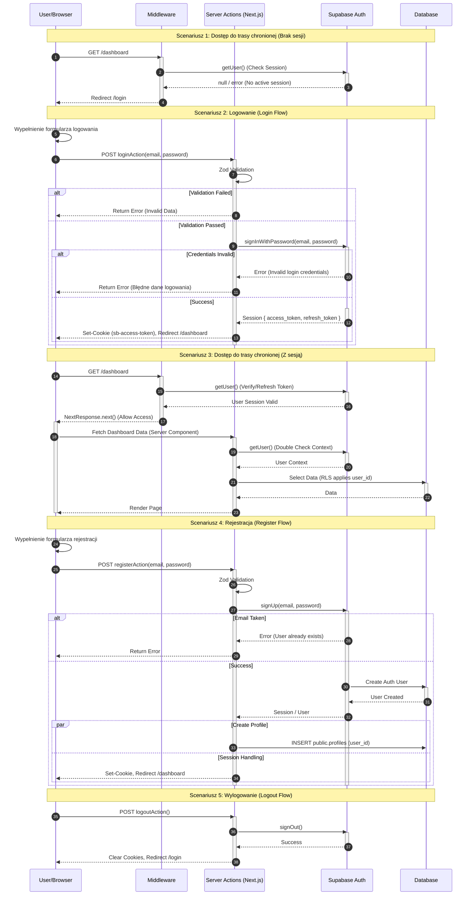

<authentication_analysis>

1.  **Przepływy autentykacji:**
    - Dostęp do trasy chronionej (z/bez sesji).
    - Logowanie (Login).
    - Rejestracja (Register).
    - Wylogowanie (Logout).
    - Odświeżanie sesji (Middleware).

2.  **Główni aktorzy:**
    - **User/Browser**: Interfejs użytkownika, inicjator akcji.
    - **Middleware**: Warstwa pośrednia Next.js (ochrona tras, odświeżanie sesji).
    - **Server Actions**: Backendowa logika Next.js (obsługa formularzy, komunikacja z Supabase).
    - **Supabase Auth**: Dostawca tożsamości (baza użytkowników, tokeny).
    - **Database**: Baza danych PostgreSQL (profile, dane biznesowe).

3.  **Procesy weryfikacji i odświeżania:**
    - Middleware sprawdza token przy każdym żądaniu (poza statycznymi).
    - `supabase.auth.getUser()` weryfikuje token i odświeża go w razie potrzeby (wspierane przez `@supabase/ssr`).
    - Ciasteczka `sb-*-auth-token` przechowują sesję.

4.  **Opis kroków:**
    _ Użytkownik wchodzi na stronę -> Middleware sprawdza sesję.
    _ Brak sesji na chronionej trasie -> Przekierowanie do logowania.
    _ Logowanie -> Server Action waliduje dane -> Supabase weryfikuje -> Ustawienie ciasteczka -> Przekierowanie.
    _ Rejestracja -> Server Action waliduje -> Supabase tworzy konto -> Opcjonalnie profil w DB -> Sesja/Przekierowanie.
    </authentication_analysis>

<mermaid_diagram>

</mermaid_diagram>
