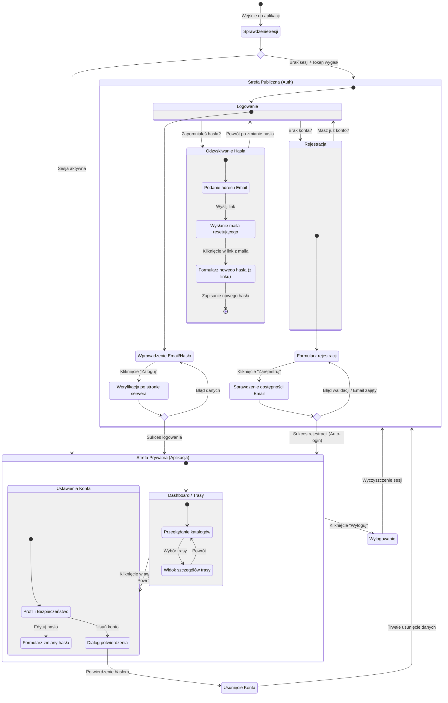

<user_journey_analysis>

1.  **Ścieżki użytkownika:**
    - **Niezalogowany (Gość)**: Próba dostępu do aplikacji -> Przekierowanie na Login -> Rejestracja lub Logowanie.
    - **Logowanie**: Formularz logowania -> Walidacja -> Przejście do Dashboardu.
    - **Rejestracja**: Formularz rejestracji -> Walidacja -> Utworzenie konta -> Automatyczne logowanie -> Dashboard.
    - **Odzyskiwanie hasła**: Zapomniane hasło -> Wpisanie emaila -> Link w emailu -> Ustawienie nowego hasła -> Logowanie.
    - **Zalogowany (Użytkownik)**: Korzystanie z Dashboardu/Tras -> Ustawienia -> Wylogowanie.
    - **Zarządzanie kontem**: Ustawienia -> Zmiana hasła lub Usunięcie konta.

2.  **Główne podróże i stany:**
    - **Strefa Publiczna**: Logowanie, Rejestracja, Reset hasła.
    - **Strefa Prywatna**: Dashboard (Katalogi/Trasy), Ustawienia.
    - **Decyzje**: Czy dane są poprawne? Czy użytkownik potwierdza usunięcie? Czy sesja jest aktywna?

3.  **Punkty decyzyjne:**
    - Start aplikacji: Czy jest sesja? (Middleware).
    - Logowanie/Rejestracja: Walidacja danych (Sukces/Błąd).
    - Usuwanie konta: Potwierdzenie (Tak/Nie).

4.  **Cel stanów:** \* _Sprawdzenie Sesji_: Routing początkowy. \* _Logowanie/Rejestracja_: Uzyskanie dostępu. \* _Dashboard_: Główna wartość biznesowa (trasy). \* _Ustawienia_: Zarządzanie bezpieczeństwem.
    </user_journey_analysis>

<mermaid_diagram>

</mermaid_diagram>
