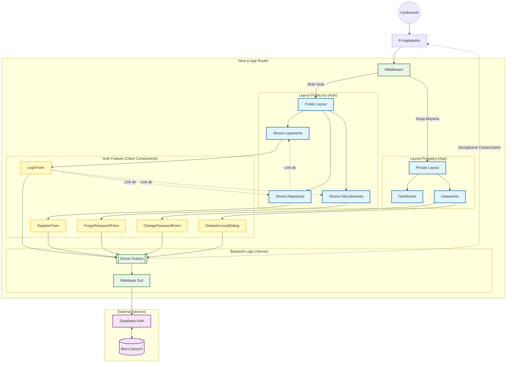

<architecture_analysis>

1.  **Komponenty wymienione w specyfikacji:**
    - **Layouts**: `PublicLayout` (nowy), `PrivateLayout` (istniejący z Sidebar/Header).
    - **Strony (Next.js Pages)**:
      - `LoginPage` (US-002)
      - `RegisterPage` (US-001)
      - `ForgotPasswordPage` (US-004)
      - `ResetPasswordPage`
      - `ProfileSettingsPage` (US-004, US-005)
    - **Komponenty (Client Features)**:
      - `LoginForm`
      - `RegisterForm`
      - `ForgotPasswordForm`
      - `ResetPasswordForm`
      - `ChangePasswordForm` (w Ustawieniach)
      - `DeleteAccountDialog` (w Ustawieniach)
    - **Logika**:
      - `auth.actions.ts` (Server Actions)
      - `middleware.ts` (Ochrona i przekierowania)
      - `SupabaseClient` (SSR/Client)

2.  **Strony i ich główne komponenty:**
    - `/login` -> `LoginForm`
    - `/register` -> `RegisterForm`
    - `/forgot-password` -> `ForgotPasswordForm`
    - `/settings/profile` -> `ChangePasswordForm`, `DeleteAccountDialog`

3.  **Przepływ danych:**
    - Formularze (Client) -> Server Actions (Server) -> Supabase Auth (External).
    - Supabase Auth -> Callback/Cookie -> Middleware -> Strona/Layout.

4.  **Funkcjonalność komponentów:**
    _ `LoginForm`: Pobiera dane, waliduje (Zod), wywołuje `loginAction`.
    _ `RegisterForm`: Waliduje hasła, wywołuje `registerAction`.
    _ `DeleteAccountDialog`: Wymaga potwierdzenia, wywołuje krytyczną akcję usunięcia.
    _ `PublicLayout`: Zapewnia kontener dla stron auth (centrowanie).
    </architecture_analysis>

<mermaid_diagram>

</mermaid_diagram>
